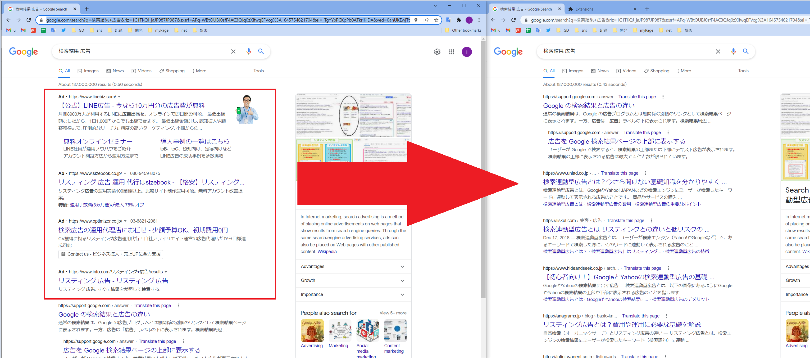
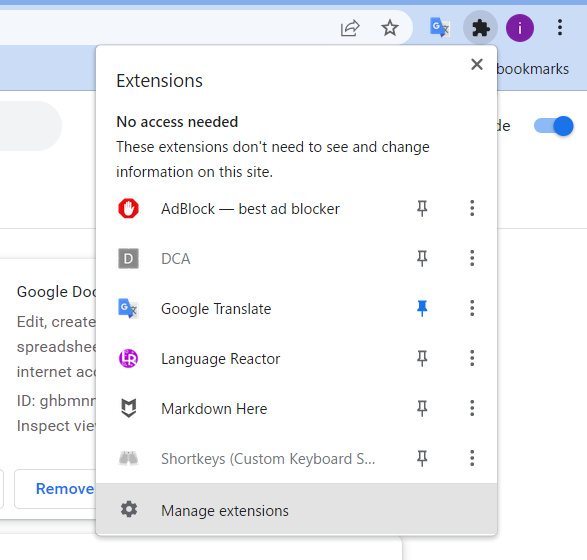
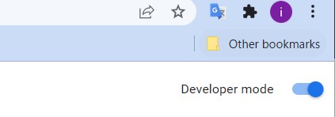

# delete chrome Ad

chromeの検索結果の広告を削除。
chromeのエクステンション審査の方針により、
正式にダウンロードできるエクスションでは再現不可。

## 備考

他の実現方法としては､"stylus"を使用する方法などがある｡  
[参考](https://pc-more.fimplex.com/article/user_style_sheets_google_chrome/)  
詳細は一番下｡

# how to use

## sourceから

1. extensionsを開く
   1. 
2. デベロッパーになる
   1. 
3. 生のファイルをロードする｡
   1. 
4. そして"manifest.json"が含まれるfolderを選択｡

# 参考

<https://developer.chrome.com/docs/extensions/mv3/getstarted/>
<https://stackoverflow.com/questions/1979583/how-can-i-get-the-url-of-the-current-tab-from-a-google-chrome-extension>
<https://stackoverflow.com/questions/6497548/chrome-extension-make-it-run-every-page-load>
[このページはクリティカル](https://stackoverflow.com/questions/19758028/chrome-extension-get-dom-content)

# stylusで検索結果削除

<https://pc-more.fimplex.com/article/user_style_sheets_google_chrome/>
<http://techoh.net/hide-google-ads-in-search-result/>

この2サイトを参考にした｡
対象は現在､"#tvcap"で対応できる｡