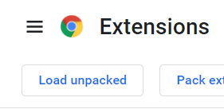

# delete chrome Ad

もうがまんできない！
まじでアイツら役に立たんし｡
金払って表示するくらいなんだからちゃんと役に立つ情報を表示しろよな｡検索ワードに一致した有益な情報を表示しろよ｡
マジで｡切れるぞ｡

## 真面目な説明｡

goolge chrome の検索結果の広告を削除｡←ここ大事｡非表示じゃなくて削除ね｡

## 備考

他の実現方法としては､"stylus"を使用する方法などがある｡  
[参考](https://pc-more.fimplex.com/article/user_style_sheets_google_chrome/)  
詳細は一番下｡

しかし､広告部分を直接消すようなエクステンションはないらしい｡googleさんが公開させてくれないのかな？

# how to use

## sourceから

1. extensionsを開く
   1. 
2. デベロッパーになる
   1. 
3. 生のやつをロードする｡
   1. 
4. そして"manifest.json"が含まれるfolderを選択｡※つまりこのリポジトリ｡

## crxから
※
だめだ｡他のchromeに入れようとするとpemエラーが出る｡  
sourceから入れるしかないか､若干めんどくさいけど｡

+ explorerでsource.crxをドラッグ
+ chrome extensions ページにドロップ

[参考](https://nmm.blog.jp/archives/23285335.html)  

# 参考

<https://developer.chrome.com/docs/extensions/mv3/getstarted/>
<https://stackoverflow.com/questions/1979583/how-can-i-get-the-url-of-the-current-tab-from-a-google-chrome-extension>
<https://stackoverflow.com/questions/6497548/chrome-extension-make-it-run-every-page-load>
[このページはクリティカル](https://stackoverflow.com/questions/19758028/chrome-extension-get-dom-content)

# stylusで検索結果削除

<https://pc-more.fimplex.com/article/user_style_sheets_google_chrome/>
<http://techoh.net/hide-google-ads-in-search-result/>

この2サイトを参考にした｡
対象は現在､"#tvcap"で対応できる｡